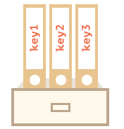
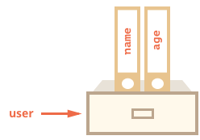
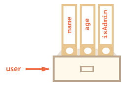
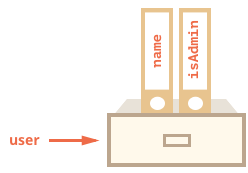
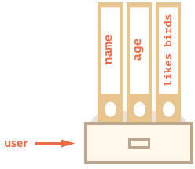
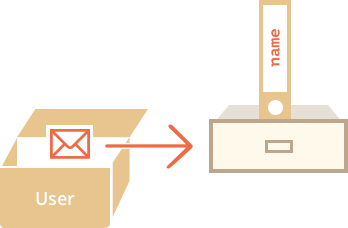
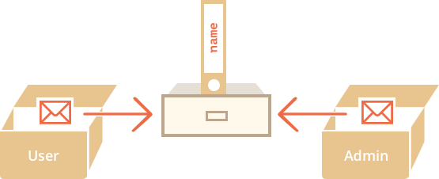

# Objects

Como sabemos por el capítulo <info:types>, hay siete tipos de datos en JavaScript. Seis de ellos se llaman "primitivos", porque sus valores contienen solo una cosa (ya sea una cadena o un número o lo que sea).

En contraste, los objetos se utilizan para almacenar colecciones codificadas de diversos datos y entidades más complejas. En JavaScript, los objetos penetran en casi todos los aspectos del lenguaje. Así que debemos entenderlos primero antes de profundizar en cualquier otro lugar.

Se puede crear un objeto con corchetes de figura `{…}` con una lista opcional de _propiedades_. Una propiedad es un par "key: value", donde `key` es una cadena (también llamada" nombre de propiedad "), y `value` puede ser cualquier cosa.

Podemos imaginar un objeto como un armario con archivos firmados. Cada pieza de datos se almacena en su archivo por la clave. Es fácil encontrar un archivo por su nombre o add/remove un archivo.



Se puede crear un objeto vacío usando una de dos sintaxis:

```js
let user = new Object(); // "object constructor" syntax
let user = {}; // "object literal" syntax
```


Usualmente, se usan los corchetes de la figura `{...}` Esa declaración se llama un _objeto literal_.

## Literals and properties

Podemos poner de inmediato algunas propiedades en los pares `{...}` como "key: value":

```js
let user = {
  // an object
  name: "John", // by key "name" store value "John"
  age: 30 // by key "age" store value 30
};
```

Una propiedad tiene una clave (también conocida como "nombre" o "identificador") antes de los dos puntos `":"` y un valor a su derecha.

En el objeto `user`, hay dos propiedades:

1. La primera propiedad tiene el nombre `" name "` y el valor `" John "`.
2. El segundo tiene el nombre `" age` y el valor `30`.

El objeto `user` resultante se puede imaginar como un gabinete con dos archivos firmados etiquetados como "name" y "age".



Podemos agregar, eliminar y leer archivos en cualquier momento.

Los valores de propiedad son accesibles usando la notación de puntos:

```js
// get fields of the object:
alert(user.name); // John
alert(user.age); // 30
```

El valor puede ser de cualquier tipo. Vamos a añadir uno booleano:

```js
user.isAdmin = true;
```



Para eliminar una propiedad, podemos usar el operador `delete`:

```js
delete user.age;
```



También podemos usar nombres de propiedades de varias palabras, pero luego se deben citar:

```js
let user = {
  name: "John",
  age: 30,
  "likes birds": true // multiword property name must be quoted
};
```



La última propiedad en la lista puede terminar con una coma:

```js
let user = {
  name: "John",
  age: 30*!*,*/!*
}
```

Eso se llama una coma "al final" o "colgando". Facilita la adición/eliminación/desplazamiento de propiedades, ya que todas las líneas se vuelven iguales.

## Square brackets

Para las propiedades de varias palabras, el acceso de puntos no funciona:

```js run
// this would give a syntax error
user.likes birds = true
```

Esto se debe a que el punto requiere que la clave sea un identificador de variable válido. Es decir: sin espacios y otras limitaciones.

Hay una alternativa "notación de corchete" que funciona con cualquier cadena:

```js run
let user = {};

// set
user["likes birds"] = true;

// get
alert(user["likes birds"]); // true

// delete
delete user["likes birds"];
```

Ahora todo está bien. Tenga en cuenta que la cadena dentro de los corchetes se cita correctamente (cualquier tipo de comillas servirá).

Los corchetes también proporcionan una forma de obtener el nombre de la propiedad como resultado de cualquier expresión, en lugar de una cadena literal, como una variable de la siguiente manera:

```js
let key = "likes birds";

// same as user["likes birds"] = true;
user[key] = true;
```

Aquí, la variable `key` puede calcularse en tiempo de ejecución o depender de la entrada del usuario. Y luego lo usamos para acceder a la propiedad. Eso nos da mucha flexibilidad. La notación de puntos no se puede utilizar de manera similar.

Por ejemplo:

```js run
let user = {
  name: "John",
  age: 30
};

let key = prompt("What do you want to know about the user?", "name");

// access by variable
alert(user[key]); // John (if enter "name")
```

### Computed properties

Podemos usar corchetes en un objeto literal. Eso se llama _computed properties_.

Por ejemplo:

```js run
let fruit = prompt("Which fruit to buy?", "apple");

let bag = {
*!*
  [fruit]: 5, // the name of the property is taken from the variable fruit
*/!*
};

alert( bag.apple ); // 5 if fruit="apple"
```

El significado de una propiedad calculada es simple: `[fruit]` significa que el nombre de la propiedad debe tomarse de `fruit`.

Entonces, si un visitante ingresa `"apple"`, `bag` se convertirá en `{apple: 5}`.

Esencialmente, eso funciona igual que:

```js run
let fruit = prompt("Which fruit to buy?", "apple");
let bag = {};

// take property name from the fruit variable
bag[fruit] = 5;
```

... pero se ve mejor

Podemos usar expresiones más complejas dentro de corchetes:

```js
let fruit = "apple";
let bag = {
  [fruit + "Computers"]: 5 // bag.appleComputers = 5
};
```

Los corchetes son mucho más poderosos que la notación de puntos. Permiten cualquier nombre y variable de propiedad. Pero también son más engorrosos de escribir.

Entonces, la mayoría de las veces, cuando los nombres de propiedades son conocidos y simples, se usa el punto. Y si necesitamos algo más complejo, entonces cambiamos a corchetes.

##### "Reserved words are allowed as property names"

Una variable no puede tener un nombre igual a una de las palabras reservadas en el idioma como "for", "let", "return", etc.

Pero para una propiedad de objeto, no hay tal restricción. Cualquier nombre esta bien

```js run
let obj = {
  for: 1,
  let: 2,
  return: 3
};

alert(obj.for + obj.let + obj.return); // 6
```

Básicamente, cualquier nombre está permitido, pero hay uno especial: `"__proto __"` que recibe un tratamiento especial por razones históricas. Por ejemplo, no podemos establecerlo en un valor sin objeto:

```js run
let obj = {};
obj.__proto__ = 5;
alert(obj.__proto__); // [object Object], didn't work as intended
```

Como vemos en el código, la asignación a un `5` primitivo se ignora.

Eso puede convertirse en una fuente de errores e incluso vulnerabilidades si pretendemos almacenar pares clave-valor arbitrarios en un objeto, y permitir que un visitante especifique las claves.

En ese caso, el visitante puede elegir "**proto**" como la clave, y la lógica de asignación se arruinará (como se muestra arriba).

Hay una manera de hacer que los objetos traten a `__proto__` como una propiedad regular, que cubriremos más adelante, pero primero necesitamos saber más sobre los objetos.
También hay otra estructura de datos [Map](info:map-set-weakmap-weakset), que aprenderemos en el capítulo <info:map-set-weakmap-weakset>, que admite claves arbitrarias.

## Property value shorthand

En el código real, a menudo utilizamos variables existentes como valores para los nombres de propiedades.

Por ejemplo:

```js run
function makeUser(name, age) {
  return {
    name: name,
    age: age
    // ...other properties
  };
}

let user = makeUser("John", 30);
alert(user.name); // John
```

En el ejemplo anterior, las propiedades tienen los mismos nombres que las variables. El caso de uso de hacer una propiedad a partir de una variable es tan común, que hay un valor de propiedad especial _ taquigrafía_ para hacerlo más corto.

En lugar de `name: name` podemos escribir `name`, de esta manera:

```js
function makeUser(name, age) {
*!*
  return {
    name, // same as name: name
    age   // same as age: age
    // ...
  };
*/!*
}
```

Podemos usar ambas propiedades normales y abreviaturas en el mismo objeto:

```js
let user = {
  name, // same as name:name
  age: 30
};
```

## Existence check

Una característica notable de los objetos es que es posible acceder a cualquier propiedad. No habrá error si la propiedad no existe! El acceso a una propiedad no existente simplemente devuelve `undefined`. Proporciona una forma muy común de probar si la propiedad existe, para obtenerla y compararla con undefined:

```js run
let user = {};

alert(user.noSuchProperty === undefined); // true means "no such property"
```

También existe un operador especial `"in"` para verificar la existencia de una propiedad.

La sintaxis es:

```js
"key" in object;
```

Por ejemplo:

```js run
let user = { name: "John", age: 30 };

alert("age" in user); // true, user.age exists
alert("blabla" in user); // false, user.blabla doesn't exist
```

Tenga en cuenta que en el lado izquierdo de `in` debe haber un _property name_. Eso suele ser una cadena entre comillas.

Si omitimos las comillas, eso significaría que se probará una variable que contenga el nombre real. Por ejemplo:

```js run
let user = { age: 30 };

let key = "age";
alert( *!*key*/!* in user ); // true, takes the name from key and checks for such property
```

##### "Using \"in\" for properties that store `undefined`"

Por lo general, la comparación estricta `"===undefined"` check funciona bien. Pero hay un caso especial cuando falla, pero `"in"` funciona correctamente.

Es cuando existe una propiedad de objeto, pero almacena `undefined`:

```js run
let obj = {
  test: undefined
};

alert(obj.test); // it's undefined, so - no such property?

alert("test" in obj); // true, the property does exist!
```

En el código anterior, la propiedad `obj.test` existe técnicamente. Así que el operador `in` funciona bien.

Situaciones como esta suceden muy raramente, porque usualmente no se asigna `undefined`. En su mayoría usamos `null` para valores" desconocidos "o" vacíos ". Así que el operador `in` es un invitado exótico en el código.

## The "for..in" loop

Para recorrer todas las teclas de un objeto, existe una forma especial del bucle: `for..in`. Esto es una cosa completamente diferente de la construcción `for (;;)` que estudiamos antes.

La sintaxis:

```js
for (key in object) {
  // executes the body for each key among object properties
}
```

For instance, let's output all properties of `user`:

```js run
let user = {
  name: "John",
  age: 30,
  isAdmin: true
};

for (let key in user) {
  // keys
  alert(key); // name, age, isAdmin
  // values for the keys
  alert(user[key]); // John, 30, true
}
```

Tenga en cuenta que todas las construcciones "for" nos permiten declarar la variable de bucle dentro del bucle, como `let key` aquí.

También, podríamos usar otro nombre de variable aquí en lugar de `key`. Por ejemplo, `"for(let prop in obj)"` también se usa ampliamente.

### Ordered like an object

¿Se ordenan los objetos? En otras palabras, si hacemos un bucle sobre un objeto, ¿obtenemos todas las propiedades en el mismo orden en que se agregaron? ¿Podemos confiar en esto?

La respuesta corta es: "ordenado de una manera especial": las propiedades enteras están ordenadas, otras aparecen en el orden de creación. Los detalles siguen.

Como ejemplo, consideremos un objeto con los códigos del teléfono:

```js run
let codes = {
  "49": "Germany",
  "41": "Switzerland",
  "44": "Great Britain",
  // ..,
  "1": "USA"
};

*!*
for(let code in codes) {
  alert(code); // 1, 41, 44, 49
}
*/!*
```

El objeto se puede utilizar para sugerir una lista de opciones al usuario. Si estamos haciendo un sitio principalmente para la audiencia alemana, entonces probablemente queremos que `49` sea el primero.

Pero si ejecutamos el código, vemos una imagen totalmente diferente:

- USA (1) va primero
- entonces Switzerland (41) y asi sucesivamente.

Los códigos telefónicos van en orden ascendente, porque son enteros. Entonces vemos `1, 41, 44, 49`.

##### "Integer properties? What's that?"

El término "propiedad entera" aquí significa una cadena que se puede convertir desde y hacia un entero sin un cambio.

Por lo tanto, "49" es un nombre de propiedad de entero, porque cuando se transforma a un número entero y vuelve, sigue siendo el mismo. Pero "+49" y "1.2" no son:

```js run
// Math.trunc is a built-in function that removes the decimal part
alert(String(Math.trunc(Number("49")))); // "49", same, integer property
alert(String(Math.trunc(Number("+49")))); // "49", not same "+49" ⇒ not integer property
alert(String(Math.trunc(Number("1.2")))); // "1", not same "1.2" ⇒ not integer property
```

... Por otro lado, si las claves no son enteras, entonces se enumeran en el orden de creación, por ejemplo:

```js run
let user = {
  name: "John",
  surname: "Smith"
};
user.age = 25; // add one more

*!*
// non-integer properties are listed in the creation order
*/!*
for (let prop in user) {
  alert( prop ); // name, surname, age
}
```

Por lo tanto, para solucionar el problema con los códigos telefónicos, podemos "hacer trampa" al hacer que los códigos no sean enteros. Agregar un signo más `"+"` antes de cada código es suficiente.

Como esto:

```js run
let codes = {
  "+49": "Germany",
  "+41": "Switzerland",
  "+44": "Great Britain",
  // ..,
  "+1": "USA"
};

for (let code in codes) {
  alert(+code); // 49, 41, 44, 1
}
```

Ahora funciona según lo previsto.

## Copying by reference

Una de las diferencias fundamentales entre los objetos y las primitivas es que se almacenan y copian "por referencia".

Los valores primitivos: cadenas, números, valores booleanos - se asignan/copian "como un valor completo".

Por ejemplo:

```js
let message = "Hello!";
let phrase = message;
```

Como resultado tenemos dos variables independientes, cada una está almacenando la cadena `"Hello!"`.


Los objetos no son así.

**A variable stores not the object itself, but its "address in memory", in other words "a reference" to it.**

Aquí está la imagen para el objeto:

```js
let user = {
  name: "John"
};
```



Aquí, el objeto se almacena en algún lugar en la memoria. Y la variable `user` tiene una "referencia" a ella.

**When an object variable is copied -- the reference is copied, the object is not duplicated.**

Si imaginamos un objeto como un gabinete, entonces una variable es una clave para él. Copiar una variable duplica la clave, pero no el propio gabinete.

Por ejemplo:

```js no-beautify
let user = { name: "John" };

let admin = user; // copy the reference
```

Ahora tenemos dos variables, cada una con la referencia al mismo objeto:



Podemos usar cualquier variable para acceder al gabinete y modificar su contenido:

```js run
let user = { name: 'John' };

let admin = user;

*!*
admin.name = 'Pete'; // changed by the "admin" reference
*/!*

alert(*!*user.name*/!*); // 'Pete', changes are seen from the "user" reference
```

El ejemplo anterior demuestra que solo hay un objeto. Como si tuviéramos un gabinete con dos llaves y usáramos una (`admin`) para entrar. Luego, si luego usamos la otra clave (`user`) veremos cambios.

### Comparison by reference

Los operadores de igualdad `==` y de igualdad estricta `===` para objetos funcionan exactamente igual.

**Two objects are equal only if they are the same object.**

Por ejemplo, dos variables hacen referencia al mismo objeto, son iguales:

```js run
let a = {};
let b = a; // copy the reference

alert(a == b); // true, both variables reference the same object
alert(a === b); // true
```

Y aquí dos objetos independientes no son iguales, aunque ambos estén vacíos:

```js run
let a = {};
let b = {}; // two independent objects

alert(a == b); // false
```

Para comparaciones como `obj1 > obj2` o para una comparación contra un primitivo `obj == 5`, los objetos se convierten en primitivos. Estudiaremos cómo funcionan las conversiones de objetos muy pronto, pero para decir la verdad, tales comparaciones son muy raras y generalmente son el resultado de un error de codificación.

### Const object

Un objeto declarado como `const` _can_ puede ser cambiado.

Por ejemplo:

```js run
const user = {
  name: "John"
};

*!*
user.age = 25; // (*)
*/!*

alert(user.age); // 25
```

Podría parecer que la línea `(*)` causaría un error, pero no, no hay ningún problema. Esto se debe a que `const` corrige el valor de `user` en sí mismo. Y aquí el `user` almacena la referencia al mismo objeto todo el tiempo. La línea `(*)` va _dentro_ del objeto, no reasigna `user`.

El `const` daría un error si intentamos establecer `user` en otra cosa, por ejemplo:

```js run
const user = {
  name: "John"
};

*!*
// Error (can't reassign user)
*/!*
user = {
  name: "Pete"
};
```

...Pero ¿y si queremos hacer constantes las propiedades del objeto? De modo que `user.age = 25` daría un error. Eso es posible también. Lo cubriremos en el capítulo <info:property-descriptors>.

## Cloning and merging, Object.assign

Entonces, copiar una variable de objeto crea una referencia más al mismo objeto.

Pero ¿y si necesitamos duplicar un objeto? Crear una copia independiente, un clon?

Eso también es factible, pero un poco más difícil, porque no hay un método incorporado para eso en JavaScript. En realidad, eso rara vez es necesario. La copia por referencia es buena la mayor parte del tiempo.

Pero si realmente queremos eso, entonces necesitamos crear un nuevo objeto y replicar la estructura del existente mediante la iteración de sus propiedades y copiarlas en el nivel primitivo.

Como esto:

```js run
let user = {
  name: "John",
  age: 30
};

*!*
let clone = {}; // the new empty object

// let's copy all user properties into it
for (let key in user) {
  clone[key] = user[key];
}
*/!*

// now clone is a fully independent clone
clone.name = "Pete"; // changed the data in it

alert( user.name ); // still John in the original object
```

También podemos usar el método [Object.assign](mdn:js/Object/assign) para eso.

La sintaxis es:

```js
Object.assign(dest[, src1, src2, src3...])
```

- Los argumentos `dest` y`src1, ..., srcN` (pueden ser tantos como sea necesario) son objetos.
- Copia las propiedades de todos los objetos `src1, ..., srcN` en `dest`. En otras palabras, las propiedades de todos los argumentos a partir del 2 se copian en el 1er. Entonces devuelve `dest`.

Por ejemplo, podemos usarlo para combinar varios objetos en uno:

```js
let user = { name: "John" };

let permissions1 = { canView: true };
let permissions2 = { canEdit: true };

*!*
// copies all properties from permissions1 and permissions2 into user
Object.assign(user, permissions1, permissions2);
*/!*

// now user = { name: "John", canView: true, canEdit: true }
```

If the receiving object (`user`) already has the same named property, it will be overwritten:

Si el objeto receptor (`user`) ya tiene la misma propiedad con nombre, se sobrescribirá:

```js
let user = { name: "John" };

// overwrite name, add isAdmin
Object.assign(user, { name: "Pete", isAdmin: true });

// now user = { name: "Pete", isAdmin: true }
```

También podemos usar `Object.assign` para reemplazar el ciclo de clonación simple:

```js
let user = {
  name: "John",
  age: 30
};

*!*
let clone = Object.assign({}, user);
*/!*
```

Copia todas las propiedades del `user` en el objeto vacío y lo devuelve. En realidad, lo mismo que el bucle, pero más corto.

Hasta ahora asumimos que todas las propiedades de `user` son primitivas. Pero las propiedades pueden ser referencias a otros objetos. Qué hacer con ellos?

Como esto:

```js run
let user = {
  name: "John",
  sizes: {
    height: 182,
    width: 50
  }
};

alert(user.sizes.height); // 182
```

Ahora no es suficiente copiar `clone.sizes = user.sizes`, porque`user.sizes` es un objeto, se copiará por referencia. Así que `clone` y `user` compartirán los mismos tamaños:

Como esto:

```js run
let user = {
  name: "John",
  sizes: {
    height: 182,
    width: 50
  }
};

let clone = Object.assign({}, user);

alert(user.sizes === clone.sizes); // true, same object

// user and clone share sizes
user.sizes.width++; // change a property from one place
alert(clone.sizes.width); // 51, see the result from the other one
```

Para solucionarlo, deberíamos usar el bucle de clonación que examina cada valor de `user[key]` y, si es un objeto, también replicar su estructura. Eso se llama una "clonación profunda".

Hay un algoritmo estándar para la clonación profunda que maneja el caso anterior y casos más complejos, llamado [algoritmo de clonación estructurada](http://w3c.github.io/html/infrastructure.html#safe-passing-of-structured-data). Para no reinventar la rueda, podemos usar una implementación funcional de la biblioteca de JavaScript [lodash](https://lodash.com), el método se llama [\_.cloneDeep(obj)](https://lodash.com/docs#cloneDeep).

## Summary

Los objetos son matrices asociativas con varias características especiales.

Almacenan propiedades (pares clave-valor), donde:

- Las claves de propiedad deben ser cadenas o símbolos (generalmente cadenas).
- Los valores pueden ser de cualquier tipo.

Para acceder a una propiedad, podemos utilizar:

- La notación de puntos: `obj.property`.
- Notación de corchetes `obj["propiedad"]`. Los corchetes permiten tomar la clave de una variable, como `obj[varWithKey]`.

Operadores adicionales:

- Para eliminar una propiedad: `delete obj.prop`.
- Para verificar si existe una propiedad con la clave dada: `"key" in obj`.
- Para iterar sobre un objeto: `for(let key in obj)` loop.

Los objetos son asignados y copiados por referencia. En otras palabras, una variable no almacena el "valor del objeto", sino una "referencia" (dirección en la memoria) para el valor. Por lo tanto, copiar una variable de este tipo o pasarla como un argumento de función copia esa referencia, no el objeto. Todas las operaciones a través de referencias copiadas (como agregar/eliminar propiedades) se realizan en el mismo objeto único.

Para hacer una "copia real" (un clon) podemos usar `Object.assign` o [\_.cloneDeep(obj)](https://lodash.com/docs#cloneDeep).

Lo que hemos estudiado en este capítulo se llama "objeto simple", o simplemente `Object`.

Hay muchos otros tipos de objetos en JavaScript:

- `Array` para almacenar las colecciones de datos ordenados,
- `Date` para almacenar la información sobre la fecha y la hora,
- `Error` para almacenar la información sobre un error.
- ...Y así.

Tienen sus características especiales que estudiaremos más adelante. A veces las personas dicen algo como "Tipo de matriz" o "Tipo de fecha", pero formalmente no son tipos propios, sino que pertenecen a un solo tipo de datos "objeto". Y lo extienden de varias maneras.

Los objetos en JavaScript son muy poderosos. Aquí solo hemos arañado la superficie de un tema que es realmente enorme. Trabajaremos de cerca con los objetos y aprenderemos más sobre ellos en otras partes del tutorial.
