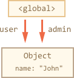
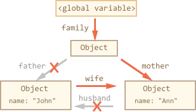
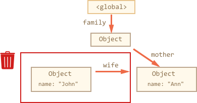
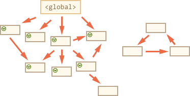

# Garbage collection

La gestión de la memoria en JavaScript se realiza de forma automática e invisible para nosotros. Creamos primitivas, objetos, funciones ... Todo eso lleva memoria.

¿Qué pasa cuando ya no se necesita algo? ¿Cómo el motor de JavaScript lo descubre y lo limpia?

## Reachability

El concepto principal de gestión de memoria en JavaScript es _reachability_.

En pocas palabras, los valores "alcanzables" son aquellos que son accesibles o utilizables de alguna manera. Están garantizados para ser almacenados en la memoria.

1. Hay un conjunto básico de valores alcanzables de forma inherente, que no se pueden eliminar por razones obvias.

Por ejemplo:

- Variables locales y parámetros de la función actual.
- Variables y parámetros para otras funciones en la cadena actual de llamadas anidadas.
- Variables globales. - (Hay algunos otros, también internos)

  Estos valores se llaman _roots_.

2. Cualquier otro valor se considera accesible si se puede acceder desde una raíz por una referencia o por una cadena de referencias.

   Por ejemplo, si hay un objeto en una variable local, y ese objeto tiene una propiedad que hace referencia a otro objeto, ese objeto se considera accesible. Y aquellos a los que hace referencia también son accesibles. Ejemplos detallados a seguir.

Hay un proceso en segundo plano en el motor de JavaScript que se llama [garbage collector](<https://en.wikipedia.org/wiki/Garbage_collection_(computer_science)>). Supervisa todos los objetos y elimina aquellos que se han vuelto inalcanzables.

## A simple example

Aquí está el ejemplo más simple:

```js
// user has a reference to the object
let user = {
  name: "John"
};
```


Aquí la flecha representa una referencia de objeto. La variable global `"user`" hace referencia al objeto `{name:"John"}` (lo llamaremos John por brevedad). La propiedad `"name"` de John almacena una primitiva, por lo que está pintada dentro del objeto.

Si el valor de `user` se sobrescribe, la referencia se pierde:

```js
user = null;
```


Ahora John se vuelve inalcanzable. No hay forma de acceder a ella, no hay referencias a ella. El recolector de basura eliminará los datos y liberará la memoria.

## Two references

Ahora imaginemos que copiamos la referencia de `user` a `admin`:

```js
// user has a reference to the object
let user = {
  name: "John"
};

*!*
let admin = user;
*/!*
```



Ahora si hacemos lo mismo:

```js
user = null;
```

... Entonces el objeto todavía es accesible a través de la variable global `admin`, por lo que está en la memoria. Si sobreescribimos `admin` también, entonces puede ser eliminado.

## Interlinked objects

Ahora un ejemplo más complejo. La familia:

```js
function marry(man, woman) {
  woman.husband = man;
  man.wife = woman;

  return {
    father: man,
    mother: woman
  };
}

let family = marry(
  {
    name: "John"
  },
  {
    name: "Ann"
  }
);
```

La función `marry` "une" dos objetos dándoles referencias entre sí y devuelve un nuevo objeto que los contiene a ambos.

La estructura de memoria resultante:


A partir de ahora, todos los objetos son alcanzables.

Ahora vamos a eliminar dos referencias:

```js
delete family.father;
delete family.mother.husband;
```



No es suficiente eliminar solo una de estas dos referencias, porque todos los objetos aún serían accesibles.

Pero si eliminamos ambos, podemos ver que John ya no tiene ninguna referencia entrante:



Las referencias salientes no importan. Solo los entrantes pueden hacer que un objeto sea accesible. Entonces, John es ahora inalcanzable y será eliminado de la memoria con todos sus datos que también se hicieron inaccesibles.

Después de la recolección de basura:


## Unreachable island

Es posible que toda la isla de objetos interconectados se vuelva inalcanzable y se elimine de la memoria.
The source object is the same as above. Then:

```js
family = null;
```

La imagen en memoria se convierte en:


Este ejemplo demuestra cuán importante es el concepto de accesibilidad.

Es obvio que John y Ann todavía están vinculados, ambos tienen referencias entrantes. Pero eso no es suficiente.

El antiguo objeto `"family"` se ha desvinculado de la raíz, ya no hay ninguna referencia a él, por lo que toda la isla se vuelve inalcanzable y se eliminará.

## Internal algorithms

El algoritmo básico de recolección de basura se llama "marcar y barrer".

Los siguientes pasos de "recolección de basura" se realizan regularmente:

- El recolector de basura coge las raíces y las "marca" (las recuerda).
- Luego visita y "marca" todas las referencias de ellos.
- Luego visita los objetos marcados y marca sus referencias. Todos los objetos visitados se recuerdan para no visitar el mismo objeto dos veces en el futuro.

- ... Y así sucesivamente hasta que haya referencias no visitadas (accesibles desde las raíces).
- Se eliminan todos los objetos excepto los marcados.

Por ejemplo, deje que nuestra estructura de objetos se vea así:


Podemos ver claramente una "isla inalcanzable" en el lado derecho. Ahora veamos cómo el recolector de basura "marca-y-barrido" se ocupa de eso.

El primer paso marca las raíces:


Luego se marcan sus referencias:



... y sus referencias, mientras sea posible:


Ahora los objetos que no se pudieron visitar en el proceso se consideran inaccesibles y se eliminarán:


Ese es el concepto de cómo funciona la recolección de basura.

Los motores de JavaScript aplican muchas optimizaciones para que se ejecute más rápido y no afecte la ejecución.

Algunas de las optimizaciones:

- **Generational collection** --
  los objetos se dividen en dos conjuntos: "nuevos" y "antiguos". Muchos objetos aparecen, hacen su trabajo y mueren rápido, se pueden limpiar agresivamente. Aquellos que sobreviven el tiempo suficiente, se vuelven "viejos" y son examinados con menos frecuencia.
- **Incremental collection** --
  Si hay muchos objetos, e intentamos caminar y marcar todo el conjunto de objetos a la vez, puede llevar algún tiempo e introducir retrasos visibles en la ejecución. Así que el motor intenta dividir la recolección de basura en pedazos. Luego las piezas se ejecutan una por una, por separado. Eso requiere un poco de contabilidad adicional entre ellos para rastrear los cambios, pero tenemos muchos retrasos pequeños en lugar de uno grande.

- **Idle-time collection** -- El recolector de basura intenta ejecutarse solo mientras la CPU está inactiva, para reducir el posible efecto en la ejecución.
  Hay otras optimizaciones y tipos de algoritmos de recolección de basura.

## Summary

Las principales cosas a saber:

- La recolección de basura se realiza automáticamente. No podemos forzarlo o impedirlo.

* Los objetos se retienen en la memoria mientras son accesibles.

* Ser referenciado no es lo mismo que ser accesible (desde una raíz): un paquete de objetos interconectados puede volverse inalcanzable en conjunto.

Los motores modernos implementan algoritmos avanzados de recolección de basura.

Si está familiarizado con la programación de bajo nivel, la información más detallada sobre el recolector de basura V8 se encuentra en el artículo [A tour of V8: Garbage Collection](http://jayconrod.com/posts/55/a-tour-of-v8-garbage-collection).
